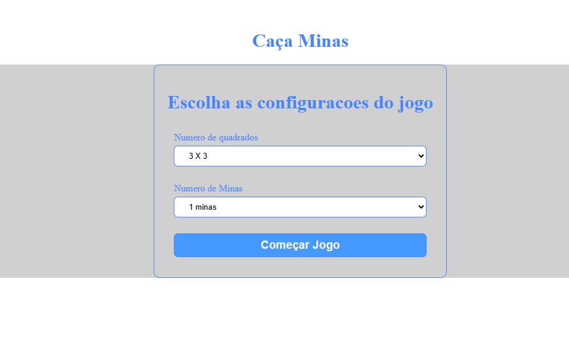
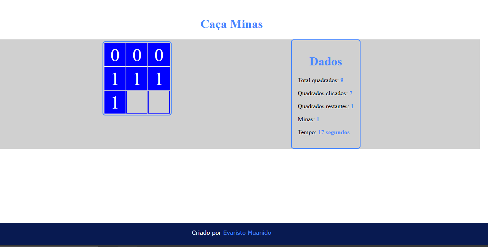
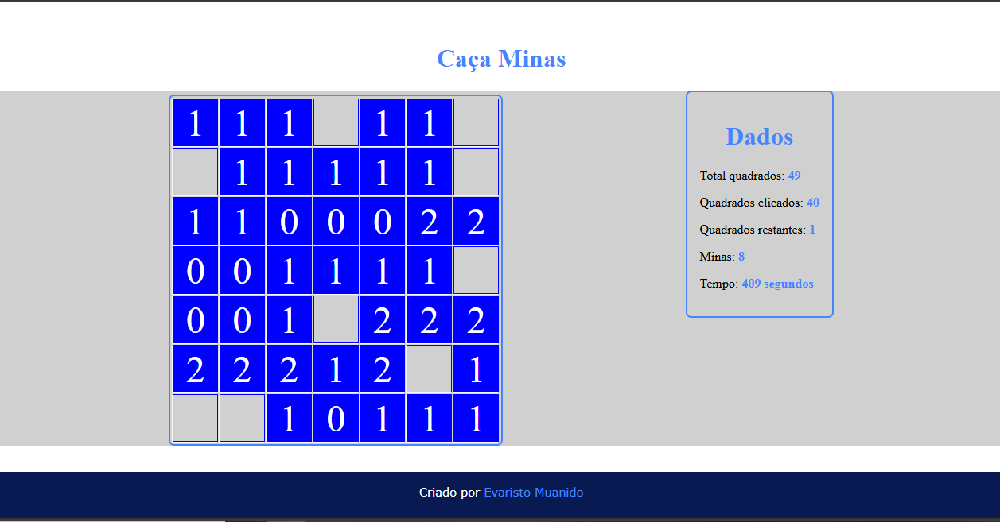
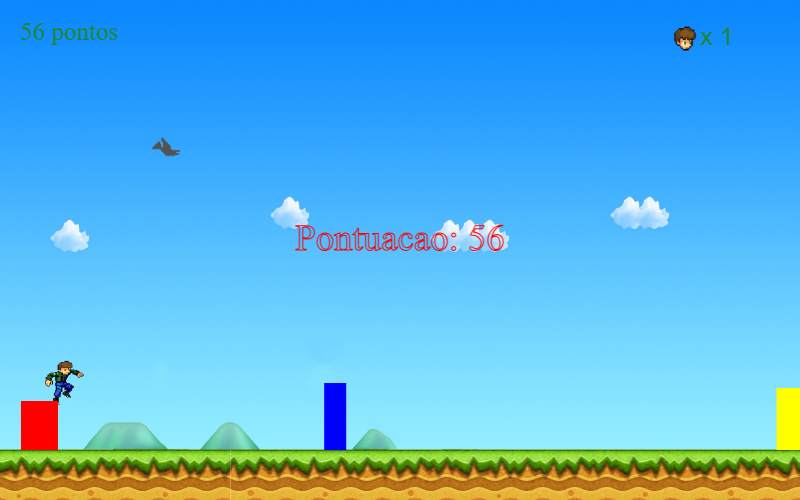

# 🎮 Jogos em JavaScript

Este repositório contém dois jogos simples desenvolvidos em **JavaScript puro**, rodando no **Live Server**.  
São eles: **Caça-Minas** (Minesweeper) e **HRun** (jogo de corrida estilo runner).

---

## 📌 Jogos incluídos

### 🟦 1. Caça-Minas
Um clone simplificado do clássico **Minesweeper**.  
O objetivo é revelar todos os quadrados sem clicar nas minas.

#### 🚀 Funcionalidades
- Contagem de tempo em tempo real ⏱️  
- Exibição de estatísticas (quadrados clicados, restantes e número de minas)  
- Diferentes tamanhos de tabuleiro  
- Interface minimalista em HTML + CSS + JS  

#### 🖼️ Capturas de tela
  
  
  

---

### 🏃 2. HRun
Um jogo estilo **infinite runner**, onde o personagem corre e precisa pular os obstáculos.  

#### 🚀 Funcionalidades
- Contagem de pontos ao sobreviver mais tempo  
- Sistema de vidas ❤️  
- Obstáculos aleatórios  
- Estilo visual inspirado em jogos de plataforma retrô  

#### 🖼️ Captura de tela
  
  
  

---

## 🛠️ Tecnologias usadas
- **HTML5**  
- **CSS3**  
- **JavaScript (ES6)**  
- [Live Server](https://marketplace.visualstudio.com/items?itemName=ritwickdey.LiveServer) para rodar localmente  

---

## ▶️ Como executar
1. Clone este repositório:  
   ```bash
   git clone https://github.com/seu-usuario/seu-repositorio.git
2. Abra o projeto no VS Code.

3. Instale a extensão Live Server.

4. Clique com o botão direito no arquivo `index.html` do jogo e selecione "Open with Live Server".

---
# 👤 Autor

Desenvolvido por Evaristo Muanido 🚀